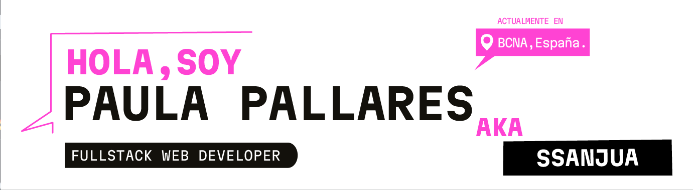

## Hi there, Im Paula 👋 also known as ssanjua 👩🏻‍💻

[]

## 🚀 About Me
📍 Currently based in Barcelona, Spain | 💻 Full Stack Developer | 🌟 Passionate about creating technologies that make a difference. With a background in multimedia and a knack for leadership, I specialize in JavaScript, React, Node.js, and more. My journey in tech started with an interactive installation at the Museum of Modern Arts in Buenos Aires, and since then, I've been committed to merging creativity with technology.

  

## Socials
 
      
 

👩‍💻 I'm currently working on a booking site.

🧠 I'm currently learning React and Typescript.

🤔 I'm looking for projects, communities and experience.

📹 I'm also a filmmaker, you can check out my material here: [[Vimeo](https://vimeo.com/ppaupallares)].

⚡️ Fun fact: My first contact with programming was an interactive installation with 360 kinect and a 3D printed mountains using processing as a programming language, it was part of an exhibition in the Museum of Modern Arts in Buenos Aires, check it out: <a href="https://vimeo.com/256058743">Vimeo</a>

